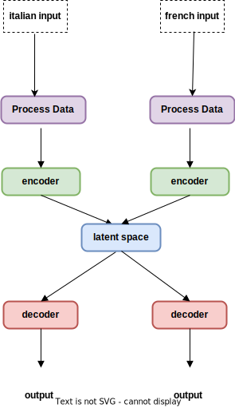

# cross-lingual-embeddings

_The goal of this project is to create embeddings for italian and french that are aligned in a shared latent space using
an encoder-decoder model_

## **REPLICABILITY**

Each experiment was conducted on a single machine by running the [main](main.py) script and specifying whether to
process the dataset or not and whether to start the optimization pipeline or not:

`python main.py --generate True --optimize True # process dataset and optimize model`  
`python main.py --generate False --optimize False # skip processing and optimization step`

### Environment

- Python 3.9
- Python dependencies: [requirements.txt](requirements.txt)

### Data Processing Script

- [utils/processing.py](utils/processing.py) - processing functions
- [utils/utils.py](utils/utils.py) - utils functions
- [dao/AEDataset.py](dao/AEDataset.py) - dataset class
- [word2vec](word2vec) word2vec models for italian and french

### Training & Testing Script

- [train.py](train.py) - training loop
- [test.py](test.py) - evaluation loop
- [dao/model.py](dao/Model.py) - model skeleton

### Results

- [plot](plot) - visual results

## **DATASET**

The parallel datasets Italian-English and French-English was obtained from the [_European Parliament Proceedings
Parallel Corpus 1996-2011_](https://www.statmt.org/europarl/). These dataset were already aligned.   To obtain an
Italian-English Corpus, the Italian-English and the French-English corpus were joined based on their english sentences
in common. It's worth noting that the two corpora did not have the same number of sentences due to different
translations. In fact, during the European Parliament session, not all languages are translated to english and then
translated back to the target language. Some languages are directly translated from source to target without going
through english first. This creates misalignment in the corpus. Therefore, some loss of information is expected.  

Due to the extensive volume of words within our corpus, exceeding 800,000, each language's vocabulary encompasses a
substantial number of words, surpassing one million in total.
After conducting various experiments, we concluded that training a Word2Vec model is a more suitable approach than a
simple "word-to-index" method in an attempt to reduce the initial size of individual word embeddings.

Using a basic "word-to-index" approach yields word embeddings with a wide range, spanning from 0 to 100,000.
This broad range can pose challenges for neural network training, as it may struggle to achieve effective reconstruction
when dealing with such large embeddings.
Conversely, normalizing these embeddings can result in exceedingly small values (e.g., 0.000000003), rendering them
impractical for reliable model reconstruction.

An alternative solution is to employ techniques like GloVe or Word2Vec. However, it's essential to note that these
methods are inherently lossy algorithms,
which can make the task of reconstructing the original sentence in natural language more challenging.

## **MODELS**

Trained models are available in this [folder](models)

  

    <ul>
      <li><a href="models/encoder_it.pt">Italian encoder</a></li>
      <li><a href="models/encoder_fr.pt">French encoder</a></li>
      <li><a href="models/decoder_it.pt">Italian decoder</a></li>
      <li><a href="models/decoder_fr.pt">French decoder</a></li>
      <li><a href="models/latent_space.pt">Latent Space Model</a></li>
    </ul>
  

  

    
  

## **LATENT SPACE PROJECTION**

