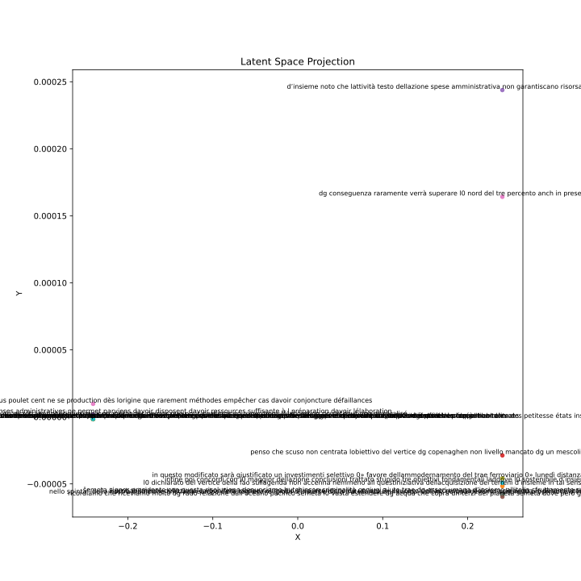

# cross-lingual-embeddings

_The goal of this project is to create embeddings for italian and french that are aligned in a shared latent space using
an encoder-decoder model_

[Weight&Biases Report](https://api.wandb.ai/links/admaiora/kunimg18)
## **REPLICABILITY**

Each experiment was conducted on a single machine by running the [main](main.py) script and specifying whether to
process the dataset or not, whether to start the optimization pipeline or not and whether to conduct an ablation study
or not (only one between optimization and ablation study can be true):

`python main.py --generate True --optimize True --ablation False # process dataset, optimize model, skip ablation study`  
`python main.py --generate False --optimize False --ablation True # skip processing and optimization step, do ablation study`

### Environment

- Python 3.9
- Python dependencies: [requirements.txt](requirements.txt)

### Data Processing Script

- [utils/processing.py](utils/processing.py) - processing functions
- [utils/utils.py](utils/utils.py) - utils functions
- [utils/dataset.py](utils/dataset.py) dataset processing functions

### Training & Testing Script

- [main.py](main.py) - main script
- [train.py](train.py) - training loop
- [test.py](test.py) - evaluation loop
- [optimization.py](optimization.py) - optimizations function
- [study.py](study.py) - ablation study

### Results

- [plot](plot) - visual results
- [ablation_study](ablation_study) - ablation study results

### Configurations

- [config/model_config.json](config/model_config.json) - model's configurations
- [dao/Model.py](dao/Model.py) - model skeleton
- [dao/Dataset.py](dao/Model.py) - dataset skeleton
- [utils/loss.py](utils/loss.py) - contrastive loss definition

## **DATASET**

The parallel datasets Italian-English and French-English was obtained from the [_European Parliament Proceedings
Parallel Corpus 1996-2011_](https://www.statmt.org/europarl/). These dataset were already aligned.   To obtain an
Italian-English Corpus, the Italian-English and the French-English corpus were joined based on their english sentences
in common. It's worth noting that the two corpora did not have the same number of sentences due to different
translations. In fact, during the European Parliament session, not all languages are translated to english and then
translated back to the target language. Some languages are directly translated from source to target without going
through english first. This creates misalignment in the corpus. Therefore, some loss of information is expected.  

Due to the extensive volume of words within our corpus, exceeding 800,000, each language's vocabulary encompasses a
substantial number of words, surpassing one million in total. The vocabulary was used to create embeddings for the
sentences by converting each word into their corresponding index in the vocabulary  

This conversion technique can pose challenges for neural network training, as it may struggle to achieve effective
reconstruction when dealing with such embeddings with such large numbers. Conversely, normalizing these embeddings can
result in exceedingly small values (e.g., 0.000000003), rendering them impractical for reliable model reconstruction.
Therefore, only the most frequent 30000 words were chosen to be included in the vocabulary.

An alternative solution that was explored was to employ techniques like GloVe or Word2Vec.
However, it's essential to note that these methods are inherently lossy algorithms, which can make the task of
reconstructing the original sentence in natural language more challenging.

## **MODEL'S ARCHITECTURE**

Each encoder is composed of an Embedding and a LSTM layer while the decoder only contains a LSTM layer and a Linear
Layer.The shared space is a linear layer that generates low dimensional embeddings. 

During training, the embeddings generated by the two encoders are aligned using a contrastive loss function while the 
decoders learn to reconstruct the original sequence starting from the embeddings using a Negative Log Likelihood loss.
### During training:

### During testing:

## **LATENT SPACE PROJECTION**

## **EMBEDDINGS PROJECTION**

